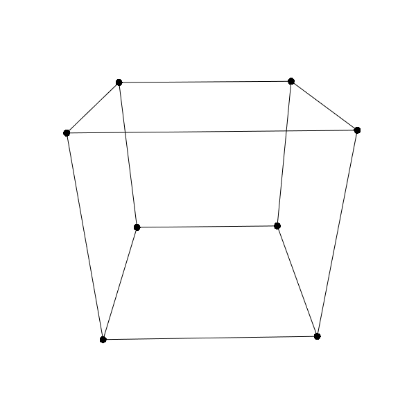

  
# 3D_proj
A primitive Python-based 3D projection repository that covers the geometry part of the graphics pipeline  
matrix.py contains some needed matrix and column vector operations  
pos.py contains a Position class with operations for 3D projection as per <a href="https://en.wikipedia.org/wiki/Graphics_pipeline">the graphics pipeline</a>  
quaternion.py contains a Quaternion class and a vector-based rotation function  
demo is done with <a href="https://arcade.academy/">Arcade</a>  
  
sources:  
<a href="https://math.stackexchange.com/questions/2305792/3d-projection-on-a-2d-plane-weak-maths-ressources">3D projection on a 2D plane ( weak maths ressources ) - Mathematics Stack Exchange</a>  
<a href="https://www.songho.ca/opengl/index.html">songho's OpenGL notes</a>  
<a href="https://computergraphics.stackexchange.com/questions/6254/how-to-derive-a-perspective-projection-matrix-from-its-components">3d - How to derive a perspective projection matrix from its components? - Computer Graphics Stack Exchange</a>  
<a href="https://stackoverflow.com/questions/21841598/when-does-the-transition-from-clip-space-to-screen-coordinates-happen">opengl - When does the transition from clip space to screen coordinates happen? - Stack Overflow</a>  
<a href="https://en.wikipedia.org/wiki/Graphics_pipeline">Graphics pipeline - Wikipedia</a>  
<a href="https://stackoverflow.com/questions/695043/how-does-one-convert-world-coordinates-to-camera-coordinates">math - How does one convert world coordinates to camera coordinates? - Stack Overflow</a>  
<a href="https://en.wikipedia.org/wiki/Quaternion">Quaternion - Wikipedia</a>  
<a href="https://en.wikipedia.org/wiki/Quaternions_and_spatial_rotation">Quaternions and spatial rotation - Wikipedia</a>  
<a href="https://math.stackexchange.com/questions/40164/how-do-you-rotate-a-vector-by-a-unit-quaternion">rotations - How do you rotate a vector by a unit quaternion? - Mathematics Stack Exchange</a>  
<a href="https://math.stackexchange.com/questions/8980/euler-angles-and-gimbal-lock">geometry - Euler angles and gimbal lock - Mathematics Stack Exchange</a>  
<a href="https://www.youtube.com/watch?v=zc8b2Jo7mno">Euler (gimbal lock) Explained - YouTube</a>  
<a href="https://gamedev.stackexchange.com/questions/40741/why-do-we-move-the-world-instead-of-the-camera">opengl - Why do we move the world instead of the camera? - Game Development Stack Exchange</a>  
<a href="https://www.youtube.com/watch?v=o1n02xKP138">Math for Game Programmers: Understanding Homogeneous Coordinates - YouTube</a>  
